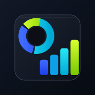

🇩🇪 [Deutsche Version](README_de.md)

# BudgetAtlas

**Live App:** https://schrotty74.github.io/BudgetAtlas/

BudgetAtlas is a local, responsive budget PWA with a modern “Focus & Flow” dashboard for desktop and mobile devices.

The app stores budget data exclusively in the browser. There is no account, no tracking, and no server-side storage of personal financial data.

## Screenshots

These screenshots show fictional demo data only.

### Mobile

 

### Desktop

## Features

- Monthly buffer, income and expenses at a glance
- Animated expense-mix donut chart
- Animated percentage bars for expense shares
- Add, edit and delete income and expenses
- Swipe-to-delete with undo on mobile devices
- Collapsible income and expense sections
- Individually selectable entries per page for income and expenses (10–25; default: 10)
- Excel import with preview and invalid-row feedback
- Excel export
- PDF export
- PNG dashboard export
- JSON backup and restore with preview
- German / English
- Dark and light mode
- Offline-capable PWA with Service Worker
- Update notification via `version.json`
- `prefers-reduced-motion` support
- Responsive desktop sidebar and mobile bottom navigation

## Demo workbook

[`demo.xlsx`](docs/examples/demo.xlsx) contains fictional sample data only and can be used directly to test the Excel import. The Excel data format remains compatible with the inherited data core.

Supported frequencies:

- `Monatlich`
- `Alle 2 Monate`
- `Quartalsweise`
- `Jährlich`
- `Variabel`

## Privacy

Budget data is stored in the browser's local storage (`localStorage`). There is no backend, no user account, and no tracking.

## Technology

- Pure HTML, CSS and JavaScript
- No framework
- No package manager
- No build step
- SheetJS for Excel import/export
- html2canvas is loaded on demand for PNG export
- Service Worker for offline use

## Status

BudgetAtlas uses its own version line, which started at `v1.0`; the current documented version is `v1.1`.

## Repository

https://github.com/Schrotty74/BudgetAtlas

## Repo activity

## License

GPL-3.0 — see [`LICENSE`](LICENSE).
